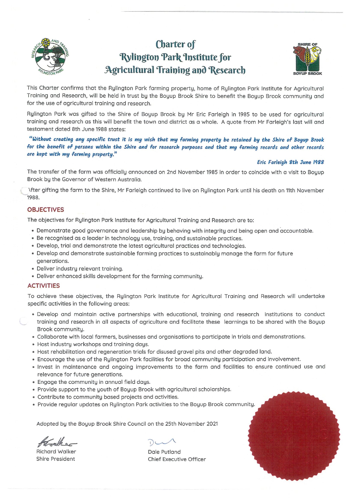

## What the Charter says

The Charter opens with these words, verbatim:

> This Charter confirms that the Rylington Park farming property, home of Rylington Park Institute for Agricultural Training and Research, will be held in trust by the Boyup Brook Shire to benefit the Boyup Brook community and for the use of agricultural training and research.

> Rylington Park was gifted to the Shire of Boyup Brook by Mr Eric Farleigh in 1985 to be used for agricultural training and research as this will benefit the town and district as a whole.

The Charter quotes Mr Farleigh's last will and testament, dated 8 June 1988:

> "Without creating any specific trust it is my wish that my farming property be retained by the Shire of Boyup Brook for the benefit of persons within the Shire and for research purposes and that my farming records and other records are kept with my farming property."

The transfer of the farm was officially announced on 2 November 1985, to coincide with a visit to Boyup Brook by the Governor of Western Australia. After gifting the farm to the Shire, Mr Farleigh continued to live on Rylington Park until his death on 11 November 1988.

## The objectives — verbatim

"The objectives for Rylington Park Institute for Agricultural Training and Research are to:

- Demonstrate good governance and leadership by behaving with integrity and being open and accountable.
- Be recognised as a leader in technology use, training, and sustainable practices.
- Develop, trial and demonstrate the latest agricultural practices and technologies.
- Develop and demonstrate sustainable farming practices to sustainably manage the farm for future generations.
- Deliver industry relevant training.
- Deliver enhanced skills development for the farming community."

## The activities — verbatim

"To achieve these objectives, the Rylington Park Institute for Agricultural Training and Research will undertake specific activities in the following areas:

- Develop and maintain active partnerships with educational, training and research institutions to conduct training and research in all aspects of agriculture and facilitate these learnings to be shared with the Boyup Brook community.
- Collaborate with local farmers, businesses and organisations to participate in trials and demonstrations.
- Host industry workshops and training days.
- Host rehabilitation and regeneration trials for disused gravel pits and other degraded land.
- Encourage the use of the Rylington Park facilities for broad community participation and involvement.
- Invest in maintenance and ongoing improvements to the farm and facilities to ensure continued use and relevance for future generations.
- Engage the community in annual field days.
- Provide support to the youth of Boyup Brook with agricultural scholarships.
- Contribute to community based projects and activities.
- Provide regular updates on Rylington Park activities to the Boyup Brook community."

The Charter is signed by the Shire President (Richard Walker) and the then Chief Executive Officer (Dale Putland), under the words "Adopted by the Boyup Brook Shire Council on the 25th November 2021".

## How the Charter was adopted

The Charter was adopted at the Ordinary Council Meeting of 25 November 2021 (item 10.4.2), after public consultation. Three details of that adoption are worth recording:

The adoption motion has no vote count or resolution number in the published minutes — unusual for a council decision. The minutes were confirmed as accurate at the following meeting on 16 December 2021 (resolution 21/12/181).

The motion changed the Charter's wording before adoption: the draft's commitment to "provide a financial contribution to community based projects from profits" resulting from the operation of the facility was replaced with the words adopted in the signed Charter — "Contribute to community based projects and activities."

The same item records that the Shire agreed to fifteen conditions on the handover of the farm. Only the Charter condition is described in the published minutes; the other fourteen are not published.

Sources: Council minutes, 25 November 2021 (item 10.4.2) and 16 December 2021, Shire of Boyup Brook — [council minutes archive](https://www.boyupbrook.wa.gov.au/council/your-council/minutes-agendas.aspx).
{: .src}

## The Charter document

The signed Charter, as adopted:

[Download the Charter (PDF)](documents/Charter_Rylington_Park_adopted_25_November_2021.pdf)
{: .src}
